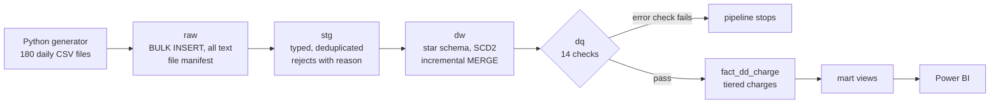
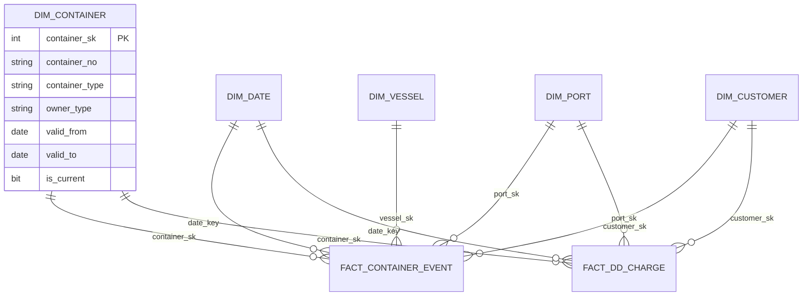
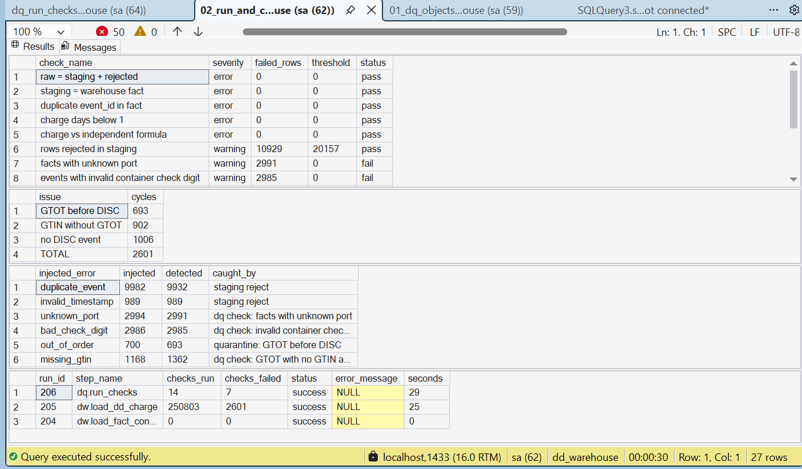
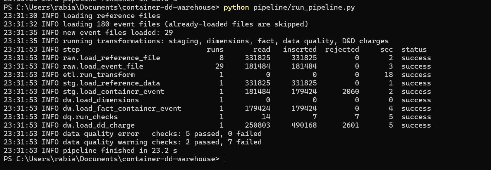
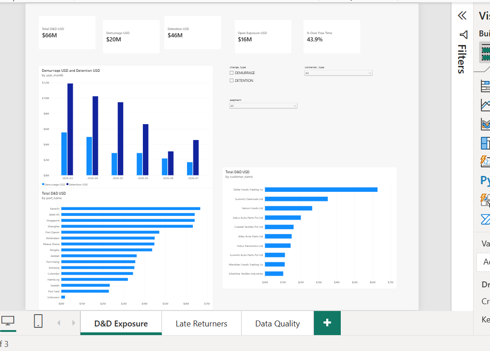
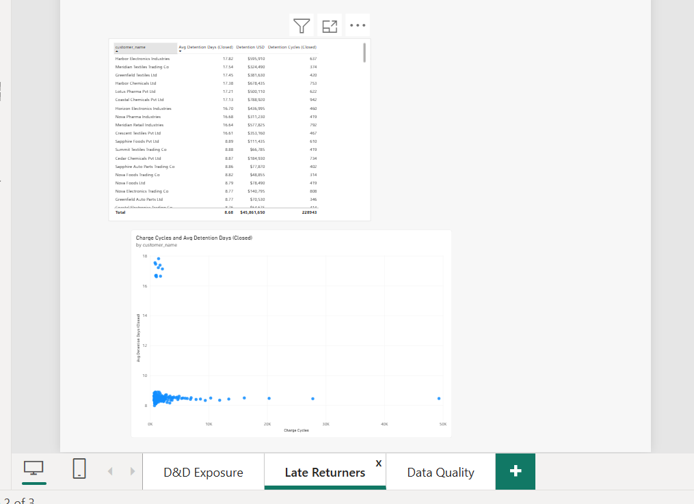
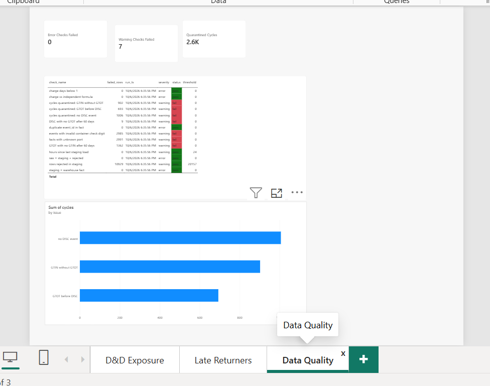

# Container Detention & Demurrage Data Warehouse

[](https://github.com/defihumair/container-dd-warehouse/actions/workflows/ci.yml)

An end-to-end SQL Server data warehouse that loads daily container event files, cleans and validates them, models them as a star schema with full history, and calculates **detention & demurrage (D&D)** charges: the fees shipping lines bill when containers stay too long at a terminal or with a customer.

All data is synthetic, generated by `data_generator/generate.py`. No employer data is used.

## At a glance

| | |
| --- | --- |
| Events processed | **1,007,895** raw events from 180 daily files (50,000 containers, 274,947 shipments) |
| Charges calculated | **490,168** demurrage and detention charges, **65,994,600 USD** |
| Data quality | **14** automated checks; every injected error type reconciled to an answer key |
| Incremental proof | Two incremental runs reconcile **exactly** to a full load, down to the last dollar |
| Tests | **18** pytest tests, run in GitHub Actions on every push |
| Stack | SQL Server 2022 (Docker), T-SQL, Python, pytest, GitHub Actions, SQL Server Agent, Power BI (PBIP) |

## Architecture



Every step writes to `etl.run_log`. One command runs it all: `python pipeline/run_pipeline.py`. SQL Server Agent schedules the transformations daily at 02:00 UTC.

## Data model



- `fact_container_event`: one row per container event (`LOAD`, `DISC`, `GTOT`, `GTIN`)
- `fact_dd_charge`: one row per booking cycle per charge type
- `dim_container` keeps **SCD Type 2** history: 1,000 ownership changes, each event joined to the version valid on its date
- Every dimension has an unknown member (`-1`), so no fact row is ever dropped

Business rules, tariff tiers and edge cases: [`docs/data_model.md`](docs/data_model.md).

## Run it

Requires Docker Desktop, Python 3.11+ and ODBC Driver 18 for SQL Server.

```bash
cp .env.example .env                      # set MSSQL_SA_PASSWORD
docker compose up -d
docker exec container-dd-warehouse-sqlserver-1 /opt/mssql-tools18/bin/sqlcmd -S localhost -U sa -P "<password>" -C -b -I -i /repo/sql/deploy_all.sql
pip install numpy pyodbc pytest
python data_generator/generate.py         # 1,007,895 events, fixed seed
python pipeline/run_pipeline.py           # load + transform + data quality + charges
python -m pytest                          # 18 tests
```

## How it works

| Stage | What happens | Code |
| --- | --- | --- |
| Generate | Realistic events with planted patterns (10 late-returning customers, seasonal peaks) and injected errors | `data_generator/` |
| Raw | Each daily file loaded exactly once (file manifest), every value kept as text | `sql/01_raw`, `sql/04_procedures/raw_*` |
| Staging | Typing, trimming, deduplication; bad rows rejected with a reason; watermark on `raw_id` | `sql/02_stg`, `stg_*` |
| Dimensions | Type 1 dimensions plus SCD2 container history | `sql/03_dw`, `dw_load_dimensions` |
| Fact load | Incremental `MERGE` on `event_id`; watermark on arrival time so late events are never missed | `dw_load_fact_container_event` |
| Data quality | 14 checks, quarantine of broken cycles, stop on error | `sql/05_dq_checks`, `dq_run_checks` |
| Charges | Cycles per booking, tiered rates with `GREATEST`/`LEAST`, open exposure to an as-of date | `dw_load_dd_charge` |
| Orchestration | Python runner plus SQL Server Agent job | `pipeline/`, `sql/08_automation` |

## Data quality: every injected error accounted for

| Injected error | Injected | Detected | Caught by |
| --- | --- | --- | --- |
| Invalid timestamp | 989 | **989** | Staging reject |
| Duplicate event | 9,982 | 9,932 | Staging reject |
| Unknown port code | 2,994 | 2,991 | DQ check |
| Bad ISO 6346 check digit | 2,986 | 2,985 | DQ check (check digit in T-SQL) |
| Gate-out before discharge | 700 | 693 | Quarantine |
| Missing gate-in | 1,168 | 1,362 | Indirect: long-open detention |

Small gaps are events that never loaded (beyond the last file) or lost their partner event upstream. If any error-level check fails, for example a single row lost between layers, the pipeline stops before charges are calculated ([evidence](docs/dq_pipeline_stop.png)).



## Incremental load = full load

The warehouse was rebuilt in two incremental runs (January–May, then June) and reconciled against the original full load:

| Metric | Full load | Two incremental runs |
| --- | --- | --- |
| Staged events | 996,966 | 996,966 |
| Rejected | 10,929 | 10,929 |
| Charge rows | 490,168 | 490,168 |
| Total D&D | 65,994,600 USD | 65,994,600 USD |
| Quarantined cycles | 2,601 | 2,601 |

The second run also rejected **43 "duplicate of loaded event"** rows, duplicates whose first copy arrived in an earlier run, which proves cross-run deduplication. A third run with no new files loads 0 rows.



## Analytics

Six business questions answered in SQL, each with a technique interviewers test (`sql/07_analytics_queries/`):

| Question | Technique |
| --- | --- |
| Top customers by D&D per port | CTE + `RANK()` |
| Running exposure per customer | `SUM() OVER` |
| Container idle time between cycles | `LEAD()` + `GROUPING SETS` |
| Customers over free time several months in a row | Gaps-and-islands |
| Month-over-month change by port | `LAG()` |
| Impossible event sequences | `EXISTS` / `NOT EXISTS` |

The gaps-and-islands query finds exactly the 10 customers planted as late returners, each over free time for 6 consecutive months.

## Performance

Four workloads benchmarked, 3 runs each, one change at a time ([full write-up](docs/performance_before_after.md)):

- **Kept:** `CONVERT()` instead of `FORMAT()` for date keys, **11× faster** in isolation (867 ms → 79 ms on 996,966 rows)
- **Rejected:** a clustered columnstore index. Storage was about 85% smaller, but `MERGE` loads were 78% slower at 1M rows
- **Rejected:** an extra booking index. +59 MB, slower loads, and the target query got slower

## Testing and CI

18 pytest tests, each inside a transaction that is rolled back, so tests never change the warehouse:

- Hand-calculated charges: 360, 210 and 1,900 USD, free time, open exposure, excluded bad sequences
- ISO 6346 check digit, layer reconciliation, idempotency, SCD2 history, data quality, mart views

On every push GitHub Actions starts SQL Server, deploys every object from scratch, generates data, runs the pipeline twice and runs all tests.

## Power BI

Three pages on `mart` views, saved as a PBIP project so the model and DAX are readable in `powerbi/`:

| D&D exposure | Late returners | Data quality |
| --- | --- | --- |
|  |  |  |

## Design decisions

- **Watermark on arrival time, not event time:** a late event has an old timestamp but a new arrival time, so it is still loaded.
- **`MERGE` on the business key:** re-running a load updates instead of duplicating.
- **SCD2 for containers, SCD1 for ports and customers:** container ownership changes matter for history; a port rename does not.
- **Cycles keyed on booking, not a running count of discharges:** a running count merged shipments when a discharge event was missing and produced negative days.
- **Unknown members instead of dropped rows:** lookups that fail are counted and reported, not hidden.

## Limitations and next steps

- Synthetic data: idle time is the same at every port because the generator uses one rule for all ports.
- Next: move transformations to dbt, replace the Python runner and Agent job with Airflow, and add a bulk-insert load path so a columnstore pays off at larger volumes.

## Author

**Muhammad Humair Qureshi** · [LinkedIn](https://linkedin.com/in/biwithhumair) · [GitHub](https://github.com/defihumair)
