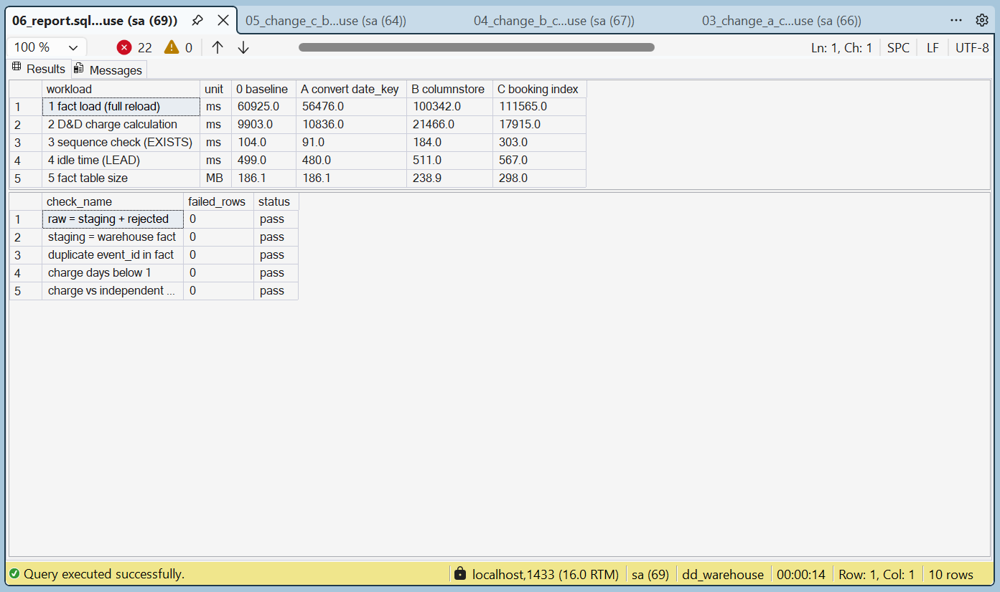
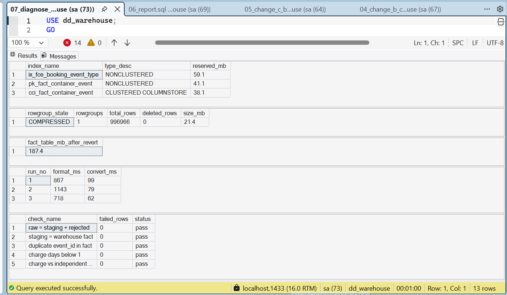

# Performance: before and after

## Method

- Harness: `etl.run_benchmark` (`sql/06_indexes/01_benchmark_objects.sql`)
- Each benchmark runs four workloads **3 times** and records the **median**
- The fact workload is a full reload of **996,966 rows**, so every run does the same work
- One change at a time, measured against the previous state
- Environment: SQL Server 2022 Developer in Docker on WSL 2, about 2.9 GB RAM available to the container

## Results (median of 3 runs)

| Workload | 0 baseline | A: `CONVERT` | B: + columnstore | C: + booking index |
| --- | --- | --- | --- | --- |
| Fact load (full reload) | 60.9 s | **56.5 s** | 100.3 s | 111.6 s |
| D&D charge calculation | 9.9 s | 10.8 s | 21.5 s | 17.9 s |
| Sequence check (`EXISTS`) | 104 ms | 91 ms | 184 ms | 303 ms |
| Idle time (`LEAD`) | 499 ms | 480 ms | 511 ms | 567 ms |
| Fact table size | 186.1 MB | 186.1 MB | 238.9 MB | 298.0 MB |

## Findings

### A. `FORMAT()` replaced by `CONVERT()`: kept

Measured in isolation on 996,966 rows (3 runs):

| Run | `FORMAT(event_ts, 'yyyyMMdd')` | `CONVERT(CHAR(8), event_ts, 112)` |
| --- | --- | --- |
| 1 | 867 ms | 99 ms |
| 2 | 1,143 ms | 79 ms |
| 3 | 718 ms | 62 ms |
| **Median** | **867 ms** | **79 ms** |

`CONVERT` is about **11× faster** for date-key derivation. In the full load the gain was 60.9 s → 56.5 s (−7%), which is close to run-to-run noise: the D&D calculation, which this change does not touch, varied by about 9% between benchmarks. The change is kept because it is strictly cheaper and removes a per-row .NET call.

### B. Clustered columnstore on the fact table: rejected at this scale

- **Storage:** the columnstore compressed all 996,966 rows into one rowgroup of **21.4 MB**, against about 145 MB for the same data as a heap. That is about **85% smaller**.
- **Load:** the full reload became **78% slower** (56.5 s → 100.3 s) and the D&D calculation took twice as long.
- **Why:** `MERGE` inserts rows one at a time into the columnstore delta store, which then needs a separate compression pass. At 1M rows the whole table fits in memory, so rowstore scans are already under half a second and there is little read time left to win.
- **Measured size:** the 238.9 MB in the benchmark included delta-store pages that had not been cleaned up yet. After background cleanup, the columnstore itself reserved 38.1 MB.
- **When to revisit:** with a bulk-insert load path (`INSERT ... WITH (TABLOCK)` for new rows instead of `MERGE`), or at 10–100× the data volume.

### C. Index on `booking_ref, event_type`: rejected

- Added **59.1 MB**, almost doubled the fact load against A, and the query it was built for got slower (184 ms → 303 ms).

## Final state

- Heap with a nonclustered primary key on `event_id`, plus change A
- Fact table **187.4 MB**
- All five error-level data quality checks pass after 12 full reloads

## Lesson

Measure first, change one thing at a time, and keep only what earns its place. Two of the three "optimisations" made this workload slower; the measurements, not assumptions, decided.
